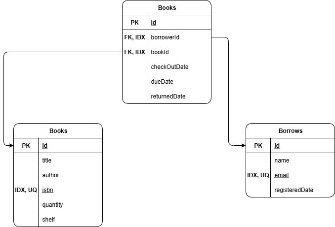

# Library Management System

A simple **Library Management System** built with Node.js, Express, and MySQL. This project allows managing books, borrowers, and loans with a RESTful API.

## Features
- CRUD operations for **Books** and **Borrowers**
- Manage **Loans**: checkout and return books
- Fetch **active loans**, **overdue books**, and **borrows for the last 30 days**
- Basic **authentication** for API protection
- Well-structured code with controllers, validators, and middlewares

## Project Structure

The project is organized in a clean and modular structure:
```
library-management-system
├── app.js
├── package.json 
├── package-lock.json 
├── .env 
├── .gitignore
├── README.md
├── controllers 
│ ├── booksController.js
│ ├── borrowersController.js
│ └── loansController.js
├── validators 
│ ├── booksValidator.js
│ ├── borrowersValidator.js
│ └── loansValidator.js
├── middlewares 
│ ├── basicAuth.js
│ ├── validate.js
│ └── errorHandler.js
├── exports
│ └── exportDB.sql
├── db 
│ └── index.js
├── assets
│ └── schema.png
├── utils 
│ └── asyncWrapper.js
├── postman_collection
│ └── Library Management System.json
└── routes 
  ├── books.js
  ├── borrowers.js
  └── loans.js
```

## Database Schema

The database consists of the following tables:

### Tables and Indexes

**Books**
- `id` (PK)
- `title`
- `author`
- `isbn` (Indexed)
- `quantity`
- `shelf`
- Index on `isbn` for faster search by ISBN

**Borrowers**
- `id` (PK)
- `name`
- `email` (Indexed)
- `registeredDate`
- Index on `email` for quick lookup

**Loans**
- `id` (PK)
- `borrowerId` (FK → Borrowers.id)
- `bookId` (FK → Books.id)
- `checkoutDate`
- `dueDate`
- `returnedDate`
- Index on `borrowerId` and `bookId` for faster queries on active loans

### Schema Diagram



This diagram shows the relationships between tables.  

## Getting Started

### 1. Install XAMPP
- Download and install **XAMPP** from [https://www.apachefriends.org](https://www.apachefriends.org)
- Start **Apache** and **MySQL** from **XAMPP** Control Panel
- Open **phpMyAdmin** at [http://localhost/phpmyadmin](http://localhost/phpmyadmin)

### 2. Import the database
1. Open phpMyAdmin
2. Click **Import**
3. Choose the file `exportDB.sql` provided in the project
4. Make sure the database name is `library-management-system` (or adjust `.env` accordingly)
5. Click **Go**

### 3. Clone the repository
```bash
git clone https://github.com/Mahmoud-Hawara/Library-Management-System.git
cd library-management-system
```

### 4. Install dependencies
```bash
npm start
# or using nodemon
npm run dev
```

## API Endpoints

### Books
| Method | Endpoint       | Body / Params                  | Description          |
|--------|----------------|--------------------------------|--------------------|
| GET    | /books         | -                              | List all books      |
| GET    | /books/search  | query: title / author / isbn   | Search books        |
| POST   | /books         | { title, author, isbn, quantity, shelf? } | Create a new book |
| PUT    | /books/:id     | { title?, author?, isbn?, quantity?, shelf? } | Update a book |
| DELETE | /books/:id     | -                              | Delete a book       |

### Borrowers
| Method | Endpoint         | Body / Params           | Description         |
|--------|-----------------|------------------------|-------------------|
| GET    | /borrowers       | -                      | List all borrowers | 
| POST   | /borrowers       | { name, email, registeredDate?}        | Create a new borrower |
| PUT    | /borrowers/:id   | { name?, email?, registeredDate? }      | Update borrower    |
| DELETE | /borrowers/:id   | -                      | Delete borrower    |

### Loans
| Method | Endpoint                          | Body / Params                  | Description                          |
|--------|----------------------------------|--------------------------------|--------------------------------------|
| GET    | /loans/borrower/:borrowerId       | -                              | List borrower's active loans         |
| GET    | /loans/overdue                    | -                              | List overdue books                   |
| GET    | /loans/bookId/:bookId             | -                              | Get currently borrowed book          |
| GET    | /loans/lastMonthBorrows           | -                              | Fetch all borrows in last 30 days   |
| GET    | /loans/lastMonthOverdue           | -                              | Fetch overdue borrows in last 30 days |
| POST   | /loans/checkout                   | { borrowerId, bookId, dueDate, returnDate, checkOutDate? } | Checkout a book                     |
| POST   | /loans/return                     | { borrowerId, bookId }         | Return a book                        |


## Postman Collection

You can use the provided Postman Collection to test all API endpoints easily. Import the collection into Postman and start sending requests.

## Authentication

All routes can be protected with **Basic Auth**:

- **Username:** admin  
- **Password:** 1234  

Add the Authorization header to your request.

